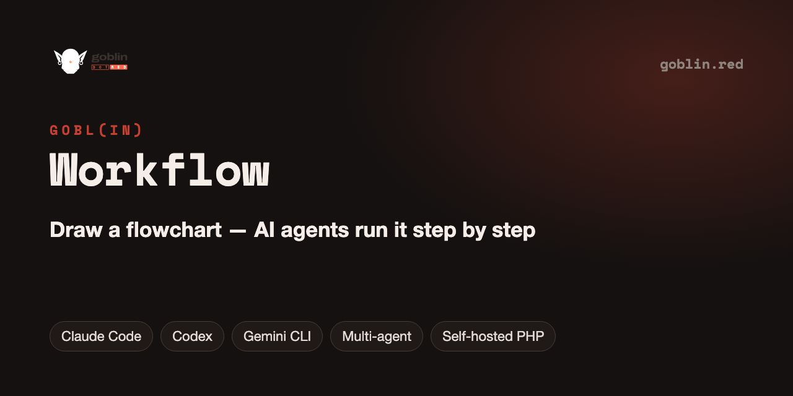
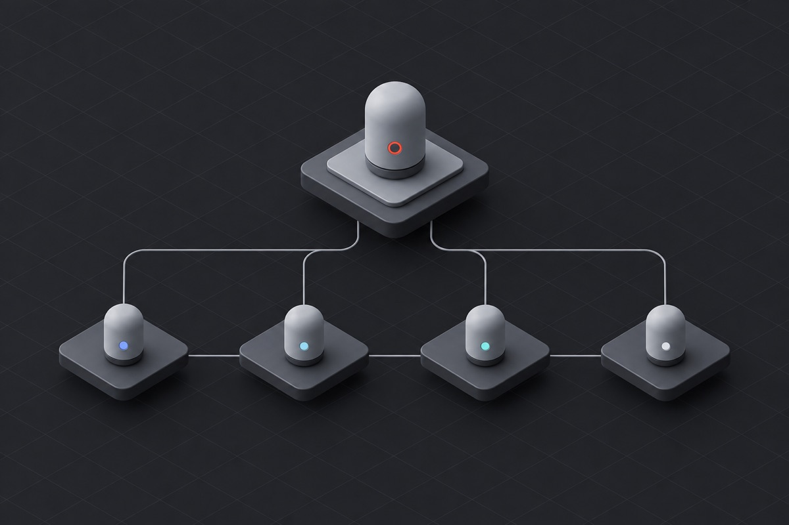

<p align="center"></p>

# GOBL(in) Workflow — draw a flowchart, let AI coding agents run it

   [](LICENSE) [](https://github.com/goblin-red/Workflow/stargazers)

**Plan a project as a flowchart and let AI coding agents execute it block by block.** Give the run link to Claude Code, Codex, Gemini CLI or Cursor: the server hands out one task at a time, checks every result and follows the arrows — branches, loops and parallel paths included — while you watch the run live on the canvas. Multi-agent orchestration with a lead and workers, an AI assistant, 26 ready-made schemes. Self-hosted, plain PHP.

<p align="center"></p>

**beta v0.95** · MIT license

Goblin is a visual workflow editor where you **draw a process as a flowchart** and **AI coding agents run it
step by step**. You describe what each block should do; the Goblin server turns the scheme into tasks, hands
them to an agent (Claude Code, Codex, Gemini CLI, Cursor and others), checks every result and moves the run
along the arrows — branches, loops and parallel paths included. You watch the run live on the canvas.

No framework, no build step: plain PHP on the server and ES modules in the browser. Runs on your own computer
or on ordinary shared hosting.

## Features

**Canvas editor**
- Blocks, decisions (yes/no), gateways, groups, areas (swimlanes), notes, tables and links — numbered hotkeys 1–8
- Arrows with labels, colors, nested folders (each folder is its own canvas), drag-and-drop between folders
- Several looks (Working, Classic, Studio, Design, Minimal and more) and a mobile layout
- English and Russian interface; instructions for agents in the project language

**Runs with AI agents**
- One link starts a run: the agent reads the server instructions and follows the scheme
- Two roles: a *lead* agent that drives the run and *workers* that do the tasks; or one agent doing everything
- Every block gets a clear task; results are checked (files present, formats, conditions) before the next step
- Decisions are answered by the agent, by a person or by the optional Jev signal model (TypeSafe)
- Live highlighting, a run log and a timeline; safe stop, retry and restart

**Built-in AI assistant** (bring your own key)
- Chat that edits the scheme for you: add steps, rearrange, explain
- Scheme builder: describe a goal, answer a few questions, get a ready flowchart
- Any OpenAI-compatible API: DeepSeek, OpenRouter (Qwen, DeepSeek and many more) or your own endpoint
- Voice input and reading answers aloud — with the browser speech engine (free) or OpenAI

**Ready-made catalog** — 26 working schemes in 10 sections: sites and landing pages, photo, video, texts,
social media, documents, data and APIs, audio, code, Goblin basics.

**Admin panel** — settings, AI connections and balances, people, projects, runs, tokens, backups and migrations.

## How a run works

1. Draw the process: a start node, blocks with descriptions, decisions and arrows.
2. Press **Start a run** and copy the run link.
3. Give the link to your agent in the terminal (Claude Code, Codex…). It reads the instructions and asks the
   server what to do next.
4. The server issues one task at a time, checks the answer and the files, follows the arrows and highlights
   progress on the canvas until the run is complete.

## Requirements

- PHP **8.1+** with `pdo_sqlite` or `pdo_mysql`, `curl`, `mbstring`, `zip`
- Database: **SQLite** (a single file — nothing to set up) or **MySQL 5.7+ / MariaDB 10.3+**
- Any web server: PHP built-in server, Apache (XAMPP, MAMP, shared hosting)

## Installation

### On your computer (macOS, PHP built-in server)

```bash
brew install php                       # macOS does not ship PHP
git clone https://github.com/goblin-red/workflow.git goblin
cd goblin
php bin/server.php install             # database, admin password, optional AI keys
php bin/server.php serve               # → http://localhost:8080
```

SQLite is suggested by default — the database is one file in `data/`.

### With XAMPP or MAMP

Put the `goblin` folder into `htdocs` and open `http://localhost/goblin/` — the installer page opens by itself.

### On a website (shared hosting)

1. Upload the files into a `goblin` folder of your site (or into the site root).
2. Open `https://your-site/goblin/` — the installer page opens.
3. Choose the database (MySQL is recommended for a website), set the admin password, optionally add AI keys.

The installer checks the server, creates the tables, loads the catalog of ready-made schemes and then
closes itself.

## Configuration

Everything is set in the admin panel — `admin.php`:

| What | Where |
|---|---|
| AI assistant (DeepSeek, OpenRouter, your own OpenAI-compatible API) | Settings → Built-in AI — model connections |
| Voice: browser (free) or OpenAI | Settings → Voice |
| Jev signal model for decisions | Settings → Jev |
| Database, paths, guests, file limits | Settings |

**API keys are not included.** Bring your own:
[DeepSeek](https://platform.deepseek.com) · [OpenRouter](https://openrouter.ai) ·
[OpenAI](https://platform.openai.com) (voice, optional) · [TypeSafe Jev](https://typesafe.ai) (optional).
Without keys the editor and runs with your own agents work; only the built-in assistant is off.
Each person can also use their own keys in their account.

Keys and passwords are stored in `secrets.php`, settings in `config_admin.php` — both are created by the
installer and never committed (see `.gitignore`, sample: `secrets.example.php`).

## Updating

```bash
git pull
php bin/server.php migrate --apply     # or: admin → System → Apply migrations
```

## Project layout

```
public/        web root: editor, admin, installer, API entry (api.php), browser code in public/src/
lib/           server: API, run engine, AI, admin, database layer (MySQL and SQLite)
views/         page templates
instructions/  instructions for lead and worker agents and the built-in AI (en, ru)
lang/          interface texts (en, ru)
sql/           schema for MySQL and SQLite, migrations, catalog of ready-made schemes
bin/server.php command line: install, serve, migrate, backup, release
md_backend/    developer documentation
```

## FAQ

**Which AI agents can run a workflow?**
Any coding agent that can read a URL and make HTTP requests: Claude Code, Codex, Gemini CLI, Cursor and others. Each block can have its own agent and model.

**Can I self-host it?**
Yes. It is plain PHP 8.1+ with SQLite or MySQL — run it on your computer or on ordinary shared hosting. Or use the hosted editor at [goblin.red](https://goblin.red).

**Is it free?**
Yes, MIT-licensed. You bring your own agent subscription or API key.

## More GOBL(in) apps

Free and open source, from the makers of [GOBL(in)](https://goblin.red):

| App | What it does |
| --- | --- |
| [GOBL(in) Remote](https://github.com/goblin-red/Goblin-Remote) | self-hosted remote desktop for macOS in any browser, over cheap PHP hosting |
| [GOBL(in) Voice](https://github.com/goblin-red/Orca-Voice) | voice control and dictation for Claude Code, Codex and Orca on macOS |
| [GOBL(in) Session Viewer](https://github.com/goblin-red/Session-Viewer) | every Claude Code, Codex, Grok and OpenCode session in one window |
| [GOBL(in) Drag & Taskbar](https://github.com/goblin-red/Drag-and-Taskbar) | move windows with trackpad gestures, a real taskbar and Alt-Tab for macOS |
| [GOBL(in) Convert](https://github.com/goblin-red/Photo-Convert) | fast batch JPEG converter and photo resizer for macOS |

If this project is useful to you, please ⭐ star it — it helps other people find it.


## License

MIT — see [LICENSE](LICENSE).
